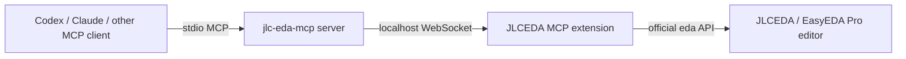

# JLCEDA MCP

JLCEDA MCP lets AI coding assistants control JLCEDA / EasyEDA Pro through the
Model Context Protocol (MCP).

The project has two pieces:

- A local MCP server written in TypeScript.
- An EasyEDA Pro / JLCEDA Pro extension bridge that connects to the server over WebSocket.

This is an early but usable bridge. It exposes safe status/context tools plus a trusted
local JavaScript execution tool for automation experiments.

## Architecture



## Requirements

- Node.js 20 or newer.
- JLCEDA Pro / EasyEDA Pro with extension support.
- Local access to `127.0.0.1:8765`.

## Install

```bash
npm install
npm run build
```

Run the server:

```bash
npm start
```

By default it listens for the EDA extension on:

```text
ws://127.0.0.1:8765
```

For bridge development without opening JLCEDA / EasyEDA, run the MCP server in one
terminal and the mock extension in another:

```bash
npm run mock-extension
```

You can change this with environment variables:

```bash
JLCEDA_MCP_HOST=127.0.0.1 JLCEDA_MCP_PORT=8765 JLCEDA_MCP_TIMEOUT_MS=30000 npm start
```

## MCP Client Config

For Codex or other MCP clients, point the server command at this package.

Local development example:

```json
{
  "mcpServers": {
    "jlc-eda": {
      "command": "node",
      "args": ["D:/JLCEDA_MCP/dist/index.js"],
      "env": {
        "JLCEDA_MCP_PORT": "8765"
      }
    }
  }
}
```

After publishing to npm, users can run it with:

```json
{
  "mcpServers": {
    "jlc-eda": {
      "command": "npx",
      "args": ["-y", "jlc-eda-mcp"]
    }
  }
}
```

## JLCEDA / EasyEDA Extension

The extension source lives in [`extension/`](./extension).

To package it as a production `.eext` extension:

1. Create an EasyEDA Pro extension project with the official `pro-api-sdk`.
2. Copy `extension/extension.json` and `extension/src/index.ts` into that project.
3. Build the extension with the official tooling.
4. Install the generated `.eext` in JLCEDA Pro / EasyEDA Pro.
5. Enable external interaction permission for the extension.
6. Start the MCP server, then use the extension menu: `JLCEDA MCP -> Connect Bridge`.

The official extension docs are here:

- [Extension API guide](https://prodocs.easyeda.com/en/api/guide/)
- [Extension configuration](https://prodocs.easyeda.com/en/api/guide/extension-json.html)
- [WebSocket API](https://prodocs.easyeda.com/en/api/reference/pro-api.sys_websocket.register.html)

## Tools

The MCP server currently registers these tools:

- `jlceda_status`: show local bridge connection status.
- `jlceda_ping`: verify that the editor extension is connected and responding.
- `jlceda_get_context`: return basic editor and environment context.
- `jlceda_eval`: run trusted JavaScript in the extension context with access to `eda`.
- `jlceda_call`: call a named bridge operation implemented by the extension.

Example `jlceda_eval` input:

```json
{
  "code": "return await eda.sys_Environment.getEditorCurrentVersion();"
}
```

## Security Model

`jlceda_eval` is powerful because it runs inside the EDA extension context. Treat it like
local shell access to your PCB editor:

- Use it only with trusted MCP clients and prompts.
- Keep the WebSocket host bound to `127.0.0.1`.
- Do not expose the bridge port to your LAN or the internet.
- Review generated scripts before running operations that modify designs.

Future versions should replace broad eval usage with narrower first-class tools for common
PCB workflows.

## Roadmap

- Package a ready-to-import `.eext` extension release.
- Add first-class tools for project metadata, document listing, schematic inspection, PCB
  inspection, DRC/ERC export, BOM export, Gerber export, and library operations.
- Add optional confirmation gates for destructive design edits.
- Add integration tests with a mock extension client.

## Publish To GitHub

```bash
git init
git add .
git commit -m "Initial JLCEDA MCP bridge"
git branch -M main
git remote add origin https://github.com/YOUR_NAME/jlc-eda-mcp.git
git push -u origin main
```

Update `extension/extension.json` with your GitHub repository URL before publishing releases.

## License

MIT
